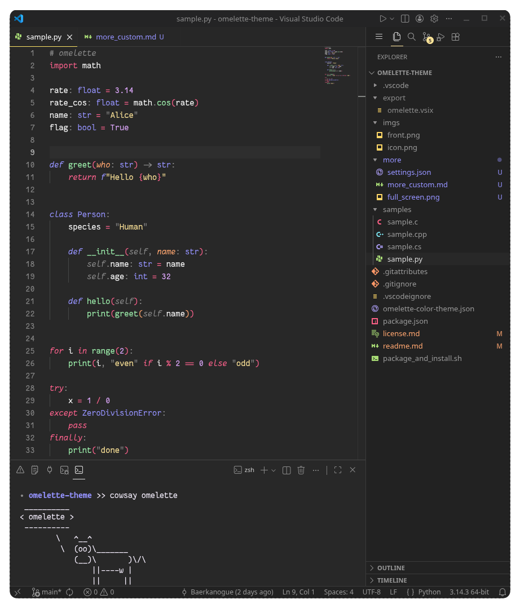

To replicate the exact visuals below, apply the settings in **[settings.json](./settings.json)**.
Paste them via the command palette: *`Ctrl+P → Preferences: Open User Settings (JSON)`*.

My font is *[Fanstasque Sans Mono](https://github.com/belluzj/fantasque-sans)* and I use *[Error Lens](https://marketplace.visualstudio.com/items?itemName=usernamehw.errorlens).*
Best with *[Monokai Pro](https://marketplace.visualstudio.com/items?itemName=monokai.theme-monokai-pro-vscode)* file icons.

