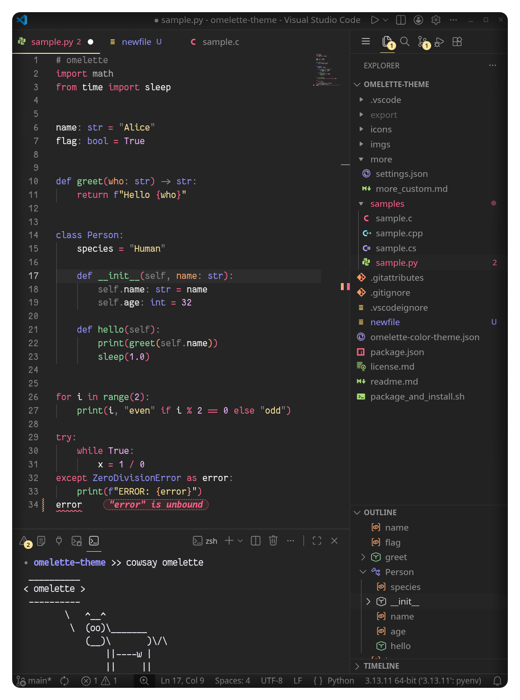
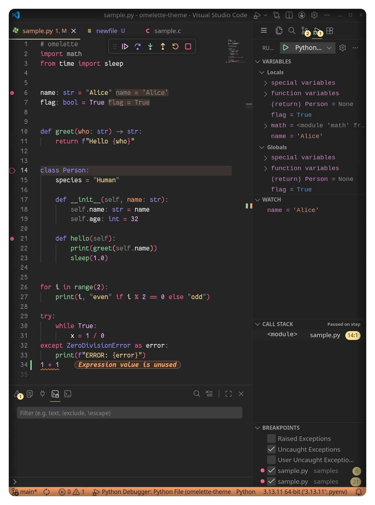

**Custom settings:**

To replicate the exact visuals below, apply the settings in **[settings.json](./settings.json)**.
Paste them via the command palette: *`Ctrl+P → Preferences: Open User Settings (JSON)`*.

**Download:**
- Font: *[Fanstasque Sans Mono](https://github.com/belluzj/fantasque-sans)*
- File icons: *[Monokai Pro](https://marketplace.visualstudio.com/items?itemName=monokai.theme-monokai-pro-vscode)*
- Error higlighting: *[Error Lens](https://marketplace.visualstudio.com/items?itemName=usernamehw.errorlens)*

Click [here](https://coolors.co/ffffff-898989-202020-fc618d-ffa770-ffe69a-8fe09e-9694ff-f3b6ff) to see the **color palette**.

Gallery
---

