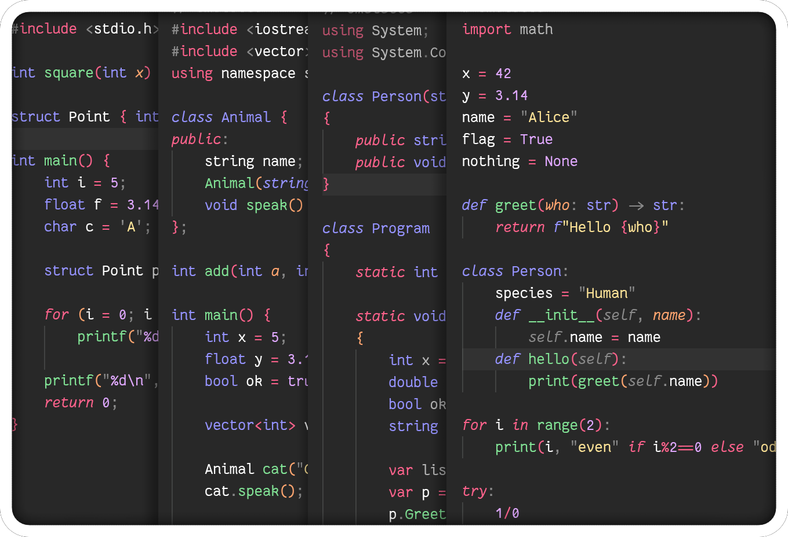

# Omelette

**Omelette** – a dark theme with colorful, muted syntax. Mid-saturation colors ensure clarity and contrast without straining the eyes, keeping code readable and visually pleasant.

Compatible with **VSCodium** and **VSCode**.



## Syntax support:
- Python
- C
- C++
- C#

## Installation

Download the VSIX file in [Releases](https://github.com/baerkanogue/omelette-theme/releases) and install with:
```bash
code --install-extension omelette.vsix
```

Or copy and paste the repo onto the VSCodium / VSCode extensions directory:
```md
# Linux
/home/<your_username>/.vscodium/extensions/
# or
/home/<your_username>/.vscode/extensions/

# Windows
C:\Users\<YourUsername>\.vscodium\extensions\
# or
C:\Users\<YourUsername>\.vscode\extensions\
```