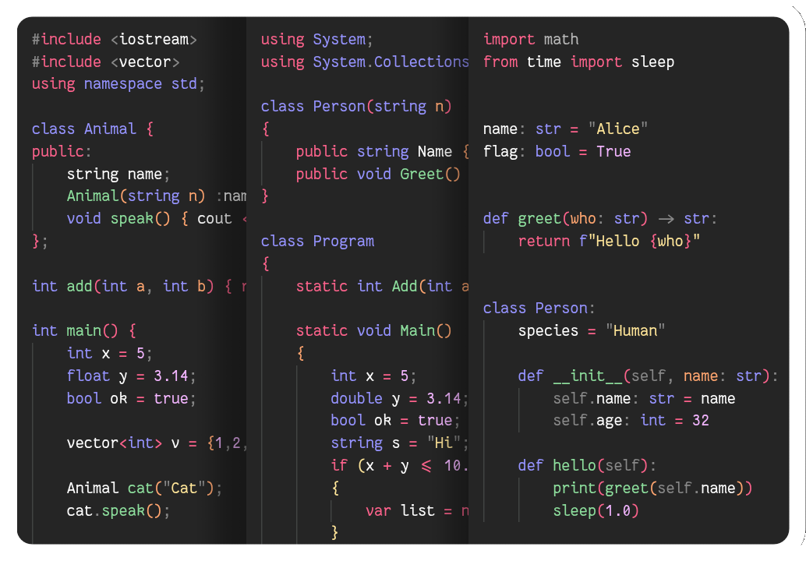

**Omelette** – a dark theme with colorful, muted syntax. Mid-saturation colors ensure clarity and contrast without straining the eyes, keeping code readable and visually pleasant.

Compatible with **VSCodium** and **VSCode**.
Made for **Python**, but also compatible with **C**, **C++**, **C#**, **Rust**, **XML**, **Markdown**, **Bash** and **Powershell**.

Extension icon by *[Théo Desmaison](https://www.instagram.com/turfboiz/)*.



<!-- For more customization options, **[read this](./more/more_custom.md)**. -->


## Installation

Download the VSIX file in [Releases](https://github.com/baerkanogue/omelette-theme/releases) and install with:
```bash
code --install-extension omelette.vsix
```

Or copy and paste the repo onto the VSCodium / VSCode extensions directory:
```md
# Linux
/home/<your_username>/.vscodium/extensions/
# or
/home/<your_username>/.vscode/extensions/

# Windows
C:\Users\<YourUsername>\.vscodium\extensions\
# or
C:\Users\<YourUsername>\.vscode\extensions\
```


## More customization

**Custom settings:**

To replicate the exact visuals below, apply the settings in **[settings.json](./more/settings.json)**.
Paste them via the command palette: *`Ctrl+P` → `Preferences: Open User Settings (JSON)`*.

**Download:**
- Font: *[Fanstasque Sans Mono](https://github.com/belluzj/fantasque-sans)*
- File icons: *[Monokai Pro](https://marketplace.visualstudio.com/items?itemName=monokai.theme-monokai-pro-vscode)*
- Error higlighting: *[Error Lens](https://marketplace.visualstudio.com/items?itemName=usernamehw.errorlens)*

Click [here](https://coolors.co/ffffff-898989-202020-fc618d-ffa770-ffe69a-8fe09e-9694ff-f3b6ff) to see the **color palette**.

### Gallery

